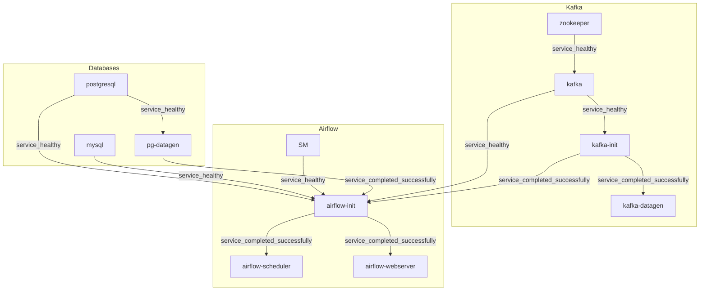

Система состоит из 10 контейнеров:
1. PostgreSQL
2. MySQL
3. Генератор данных для PostgreSQL (pg_datagen)
4. Генератор данных для Kafka (kafka_datagen)
5. Kafka Init
6. Kafka
7. Zookeeper
8. Airflow Init
9. Airflow Scheduler
10. Airflow Webserver

- Создание баз данных, пользователей, таблиц и выдача прав реализованы как идемпотентные операции, что гарантирует корректное повторное выполнение без дублирования.
- Генерация данных в PostgreSQL также идемпотентна: каждый запуск проверяет наличие ранее созданных данных и не выполняет повторную генерацию в случае их наличия.
- Все подключения и конфигурации в Airflow создаются автоматически при инициализации сервиса `airflow-init`, включая соединения, пользователи и базовые настройки.

### Dependency Graph сборки

Каждая нода графа - отдельный сервис.



### PostgreSQL
- **URL**: `jdbc:postgresql://localhost:5432/postgres_finals_db?currentSchema=postgres_finals_schema`
- **Логин**: `finals_user`
- **Пароль**: `finals_pass`

### MySQL
- **URL**: `jdbc:mysql://localhost:3306/mysql_finals_db`
- **Логин**: `finals_user`
- **Пароль**: `finals_pass`

### Airflow Web UI
- **URL**: `http://localhost:8080`
- **Логин**: `admin`
- **Пароль**: `admin`

### Kafka
- **Bootstrap Servers**: `localhost:9092`
- **Топик**: `new_user_events`

### Генерация данных

**Параметры генерации для PostgreSQL по умолчанию:**
  - Количество пользователей: 5000
  - Количество товаров: 500
  - Количество заказов: 10000
  - Детали заказов: 40000
  - Категории товаров: 5000

**Параметры генерации для Kafka по умолчанию:**
  - Интервал генерации событий: 3 секунды
  - Топик Kafka: `new_user_events`
  - События генерируются в формате JSON с полями: `first_name`, `last_name`, `email`, `phone`, `registration_date`, `loyalty_status`.


## Сборка, деплой и запуск DAG

1. Склонировать проект:
    ```
    git clone git@github.com:akkypat/dzPython_Rum_HSE.git
    ```
2. Перейти в корневую директорию проекта:
    ```
    cd dzPython_Rum_HSE
    cd IDZ
    ```
3. Запустить команду:
    ```
    docker compose up --build [-d]
    ```
4. После сборки проекта и его развертывания будут доступны интерфейсы PostgreSQL, MySQL, Airflow, Kafka по указанным выше URL.
5. Все что остается сделать вручную после окончания деплоя - включить (переевсти в `unpaused`) DAG в UI Airflow. Т.к. используется всего один executor (`SequentialExecutor`), включать необходимо в следующей последовательности:
    1. replicate_from_pg_to_mysql
    2. create_analytical_marts
    3. stream_from_kafka_to_pg
